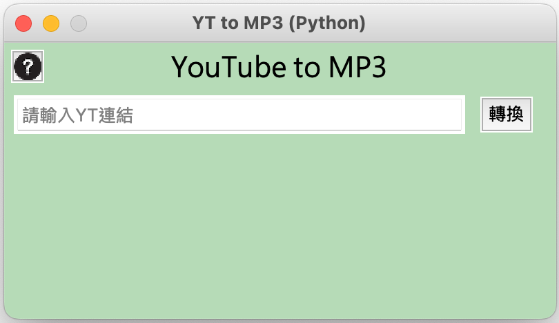

# YT 影音下載工具 - YT_Downloader

###### Tags: `YouTube` / `YouTube MP3` / `YouTube MP4` / `YouTube Download`

## 必備軟體
* Python

## 安裝流程

* **Step1：** 按下「右上方Code」→ 「Download ZIP」→ 並解壓縮
* **Step2：** 打開「終端機」 → 並輸入 `pip install --upgrade pytubefix`
* **Step3：** 打開解壓縮的「資料夾」 → 找到「YT_Downloader.py」並打開
* **Step4：** 即可開始使用「YT_Downloader」！

## 使用方法

* **Step1：** 複製YouTube連結 並貼入「文字輸入框」
* **Step2：** 按下「轉換」
* **Step3：** 選擇下載格式
* **Step4：** 按下「下載」
* **Step5：** 路徑將顯示於頁面中！
